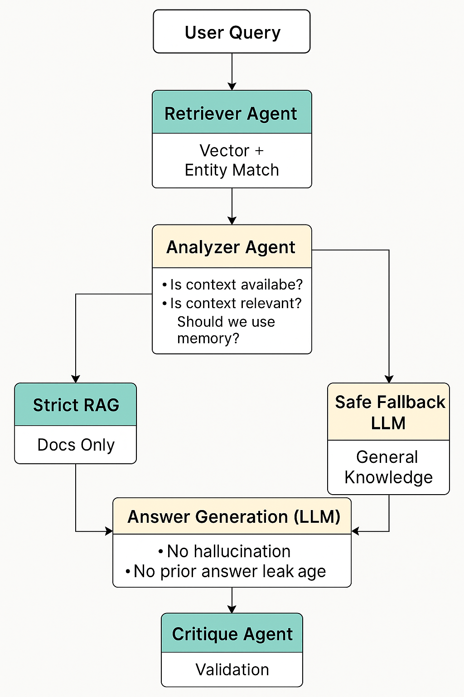

🤖 SentinelRAG ~ A Multi-Agent, Grounded Retrieval-Augmented AI Chatbot

📌 Overview

    SentinelRAG is a production-grade Retrieval-Augmented Generation (RAG) system designed to provide accurate, grounded, and transparent AI responses over user-provided documents.
    It combines semantic vector search with a multi-agent architecture to prevent hallucinations while maintaining a natural conversational experience.

    The system enforces strict grounding rules when documents are relevant and safely falls back to pretrained language model knowledge when no relevant information exists.

🎯 Motivation

    Large Language Models are powerful but prone to:

    Hallucinations

    Overconfidence

    Mixing prior answers with new queries

    SentinelRAG was designed to solve these issues by:

    Separating responsibilities into specialized agents

    Enforcing strict document grounding

    Preventing self-reinforcement from previous answers

    Explicitly distinguishing between document-based and general-knowledge answers

🧠 System Architecture

    SentinelRAG uses a multi-agent pipeline:

    Retriever Agent
    Performs vector search and entity-aware re-ranking over indexed documents.

    Analyzer Agent
    Decides how to answer:

    Strict RAG (documents only)

    Safe fallback to general knowledge

    Pure conversational LLM

    Critique Agent
    Evaluates answer faithfulness against the used context.

    Memory Module
    Stores relevant conversational facts and makes them retrievable.
🔁 System Workflow

🔁 Workflow Diagram

            User Query
            
            │
            ▼
            
            ┌──────────────┐
            │ Retriever    │
            │ Agent        │
            │ (Vector +    │
            │ Entity Match)│
            └──────┬───────┘
                │
                ▼
            ┌───────────────────────────┐
            │ Analyzer Agent             │
            │ ───────────────────────── │
            │ • Is context available?   │
            │ • Is context relevant?    │
            │ • Should we use memory?   │
            └──────┬───────────┬────────┘
                │           │
                │           │
                ▼           ▼
            ┌──────────────┐  ┌────────────────────┐
            │ Strict RAG   │  │ Safe Fallback LLM   │
            │ (Docs Only) │  │ (General Knowledge) │
            └──────┬───────┘  └──────────┬─────────┘
                │                     │
                ▼                     ▼
            ┌──────────────────────────────────┐
            │ Answer Generation (LLM)           │
            │ • No hallucination                │
            │ • No prior answer leakage         │
            └──────────────┬───────────────────┘
                        ▼
                    Final Answer + Sources
                        │
                        ▼
                    Critique Agent (Validation)

✨ Key Features

    🔍 Semantic Vector Search using ChromaDB

    🧠 Entity-Aware Retrieval & Re-Ranking

    🔒 Strict Hallucination Prevention

    🔁 Conversational Memory Integration

    🧭 Safe Fallback to Pretrained LLMs

    🧩 Multi-Agent Modular Architecture

    📄 Document Upload & Automatic Indexing

    🖥 Streamlit Interactive UI

🧪 Supported Question Types

    “Who is X?” (entity questions)

    “Explain topic Y from the documents”

    “Summarize file Z”

    Follow-up questions using chat memory

    General questions not covered by documents (explicit fallback)

🛠 Tech Stack

    Python

    ChromaDB (Vector Database)

    Sentence-Transformers (Embeddings)

    Streamlit (Frontend UI)

    Multi-Agent Orchestration

    Retrieval-Augmented Generation (RAG)

🚀 Installation & Setup
    git clone https://github.com/FadiKais1/SentinelRAG-A-Multi-Agent-Retrieval-Augmented-AI-Chatbot.git
    cd SentinelRAG-A-Multi-Agent-Retrieval-Augmented-AI-Chatbot
    python -m venv venv
    venv\Scripts\activate
    pip install -r requirements.txt
    Create a .env file:
    LLM_PROVIDER=nvidia
    NVIDIA_API_KEY=your_key_here
    OPENAI_API_KEY=optional
    Run the application:streamlit run frontend/chatbot_app.py

📄 Usage

    Upload .txt or .pdf documents

    Click Reindex Documents

    Ask questions about the uploaded content

    Observe:

    Grounded answers when documents apply

    Explicit fallback when they do not

    Source attribution for transparency

🧩 Design Principles

    Correctness over creativity

    Transparency over hidden behavior

    Explicit fallback instead of silent hallucination

    Separation of concerns via agents

    Explainable decision logic

⚠️ Limitations

    Entity extraction uses heuristic rules (not full NER)

    Vector search quality depends on embedding model

    Memory is short-term (configurable)

🔮 Future Improvements

    Named-Entity Recognition (spaCy)

    Hybrid BM25 + Vector retrieval

    Confidence scoring per answer

    Per-document query scoping

    Deployment on Streamlit Cloud / Docker

📜 License

    MIT License — free to use, modify, and distribute.

🙌 Acknowledgements

    Built as a learning-focused yet production-oriented exploration of modern RAG system design and AI safety principles.
